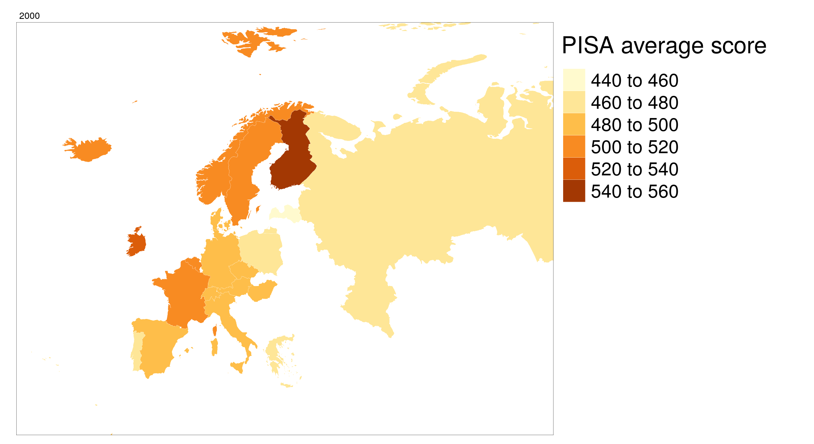
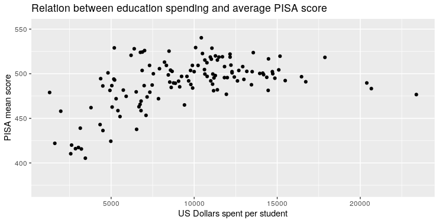

# Enquête sur l'indicateur de PISA
Note collective pour le cours La vie sociale des données
Markéta Ovečková &amp; Michal Kubala &amp; Vojtěch Holík

## Introduction: C'est quoi PISA ?

## Difficultés de ses usages et possibles critiques

## Visualisation de la base de données et interprétation

Afin d’analyser les indices PISA, nous avons traité les données disponibles sur le site de l’OCDE et nous en avons produit les visualisations suivantes.

### La différence entre les scores des filles et des garçons par discipline de 2000 à 2018 

Sur les 3 graphiques ci-dessus, on observe les différences entre les scores PISA des filles et des garçons dans les trois disciplines : la lecture, les mathématiques et les sciences. Les filles réussissent en moyenne de 30 points PISA de mieux que les garçons en lecture, et les garçons de 5 à 10 points en mathématiques. En sciences, les scores sont étonnamment similaires. Pour les 3 disciplines, on constate que les résultats moyens, notamment en mathématiques pour les garçons et sciences pour les deux genres, diminuent progressivement dans le temps. Cela signifie-t-il que les élèves apprennent moins dans ces matières aujourd'hui qu'il y a 20 ans  ? Peut-on garantir le même niveau de difficulté dans les tests PISA d'une année à l’autre ?

### La distribution des résultats PISA par discipline par pays

Le graphique suivant montre les résultats par discipline de chaque pays de 2000 à 2018. Les points noirs représentent les résultats PISA moyens des pays entre 2000 et 2018, les points colorés indiquent les résultats par discipline pour chaque année où le pays concerné a participé aux tests. Bien que l'écart entre le score moyen le plus élevé (celui de la Finlande) et le score moyen le plus bas (celui de l’Inde) soit assez important (près de 160 points), la grande majorité des scores moyens des pays se situent entre 475 et 525. Nous voyons que les performances des pays sont plutôt constantes dans le temps. La Finlande, par exemple, n’a jamais obtenu de résultats inférieurs au score moyen des États-Unis. Il semble donc que l’indice de performance éducative, tel que mesuré par PISA, ne soit pas aléatoire et qu’il existe des raisons objectives pour les différences entre les états. On observe également que certains obtiennent systématiquement de meilleurs résultats dans certaines matières que dans d'autres : c’est le cas de l'Irlande et ses scores de lectures ou de la Belgique et du Chile et de leurs scores en mathématiques. La limitation de ce graphique repose sur le fait que certains pays ont participé aux tests PISA plus de fois que d’autres, ce qui signifie que les données ne sont pas complètes. 

### Les résultats moyens de PISA en Europe à travers les années

Le graphique ci-dessous montre les résultats moyens de PISA par pays et par année en Europe. On observe une illustration de l'égalisation progressive des résultats. Dans les années 2000, les résultats de la Finlande étaient nettement supérieurs à ceux des autres pays européens. Cette différence n'est plus aussi prononcée ces dernières années, notamment à cause de la détérioration des scores finlandais. Dans tous les cas, on peut observer que certaines différences persistent : La Russie, la Slovaquie ou la Grèce font toujours partie des États les moins performants, tandis que la Finlande, l'Estonie et la Pologne obtiennent souvent les meilleurs résultats.
 
### La relation entre les dépenses en éducation (mesurées par USD$ par étudiant) et les résultats moyens de PISA

Sur le graphique ci-dessus, on observe la relation entre les dépenses en éducation mesurées par USD$ par étudiant et les résultats de PISA. Cette relation se montre positive : en général, plus un pays dépense en éducation par étudiant, plus son score moyen de PISA est élevé. Les coefficients de régression linéaire montrent qu’un accroissement en dépenses d’éducation par étudiant de 1000 dollars est associé généralement avec une augmentation des score moyens de PISA de 3,4 points (le niveau de confiance est 99%). La valeur des résiduels carrés R2 est 0.25 : la variation des dépenses d’éducation expliquent donc 25% de la variation de la performance PISA.  Néanmoins, comme on le voit sur le graphique, la relation entre les deux variables est beaucoup plus importante quand les dépenses d’éducation sont inférieures à 10 000 US$ par étudiant. Pour les pays situés au-dessous de cette barre, une augmentation en dépenses d’éducation par étudiant de 1000 dollars résulte dans une hausse des score moyens de PISA de 8,4 points et les dépenses en éducation expliquent même 36% de la variation dans les scores de PISA. Pour les pays situés au-dessus de la barre, l’effet devient négatif (-2,1) et statistiquement moins significatif. Il est possible que lorsque les dépenses en éducation par étudiant dépassent cette barre, d'autres facteurs cachés derrière les résultats de PISA, tels que la taille des classes, les inégalités sociales et le système scolaire, commencent à jouer un rôle plus important.

### La relation entre les scores moyens de PISA et les taux de réussites dans l'enseignement secondaire par genre

Il est également intéressant de se demander si les scores de PISA pourraient expliquer les réussites aux examens finaux de l’enseignement secondaire. Sur le graphique ci-dessus, nous observons que cette relation est effectivement positive : une hausse du score moyen de PISA de 10 points est liée à un accroissement dans le taux de réussite dans l'enseignement secondaire de 1,9%. La relation se montre plus forte pour les garçons que pour les filles : la piste de la ligne de régression est plus raide pour les filles que pour les garçons, bien que les filles soient généralement supérieures dans le taux de réussite dans l’enseignement secondaire et dans les scores PISA. L'interprétation de ce graphique, aussi que du précédent, se heurte aux limitations importantes car nous n’observons les données qu’au niveau national. Quoique la comparaison entre les pays soit pertinente, il existe des nuances importantes dans les pays même. Pour pouvoir tirer des conclusions avec plus de confiance, il nous faudrait observer les variables au niveau individuel, auquel elles ne sont pas disponibles. Une analyse avec des effets fixés des caractéristiques des pays pourrait apporter plus de lumière sur les questions que nous soulevons ici, mais une telle tâche dépasse le cadre de cette note.

